# Exno:1
Data Cleaning Process

# AIM
To read the given data and perform data cleaning and save the cleaned data to a file.

# Explanation
Data cleaning is the process of preparing data for analysis by removing or modifying data that is incorrect ,incompleted , irrelevant , duplicated or improperly formatted. Data cleaning is not simply about erasing data ,but rather finding a way to maximize datasets accuracy without necessarily deleting the information.

# Algorithm
STEP 1: Read the given Data

STEP 2: Get the information about the data

STEP 3: Remove the null values from the data

STEP 4: Save the Clean data to the file

STEP 5: Remove outliers using IQR

STEP 6: Use zscore of to remove outliers
## CODING AND OUTPUT:
```py

            Developed by: Sathish R
            Regno: 212222100048
```
# 1) Read and display DataFrame
```py
import pandas as pd
df=pd.read_csv('/content/SAMPLEDS.csv')
df
```
## OUTPUT:
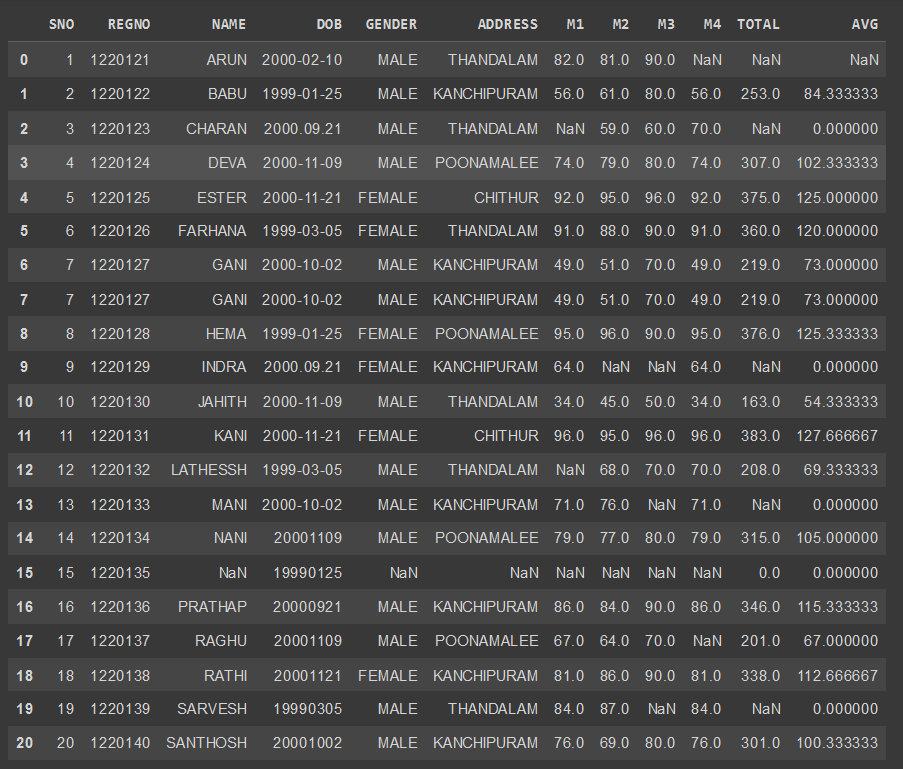

## 2) Display head
```py
df.head()
```
## OUTPUT:
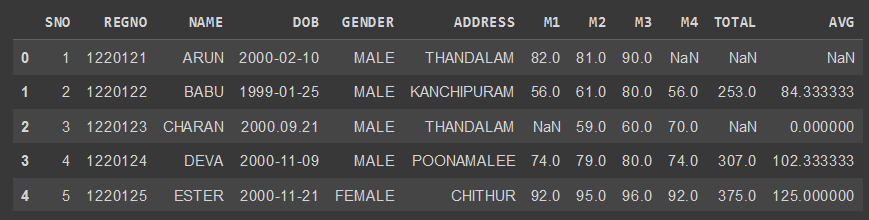

## 3) Display tail
```py
df.tail()
```
## OUTPUT:
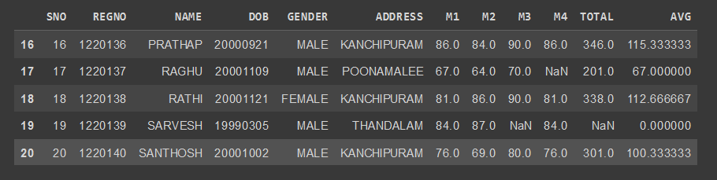

## 4) Info of dataframe
```py
df.info()
```
## OUTPUT:
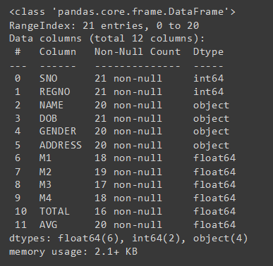

## 5) Describe about the dataframe
```py
df.describe()
```
## OUTPUT:
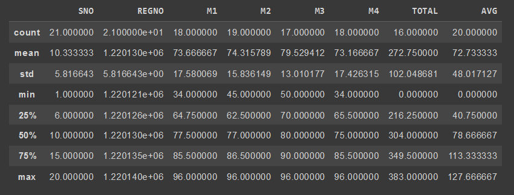

## 6) Shape of the dataframe
```py
df.shape
```
## OUTPUT:
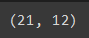

## 7) Checking tha NUll values
```py
df.isnull().sum()
```
## OUTPUT:
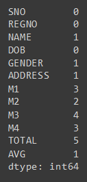

## 8) Drop the Null values
```py
x=df.dropna(how='any')
x
```
## OUTPUT:
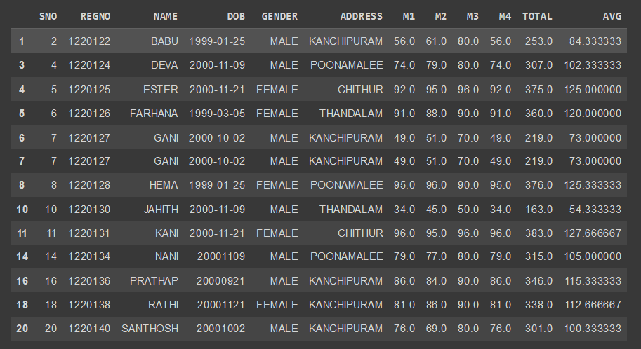

## 9) Drop the Null values in Total
```py
tot=df.dropna(subset=['TOTAL'],how='any')
tot
```
## OUTPUT:
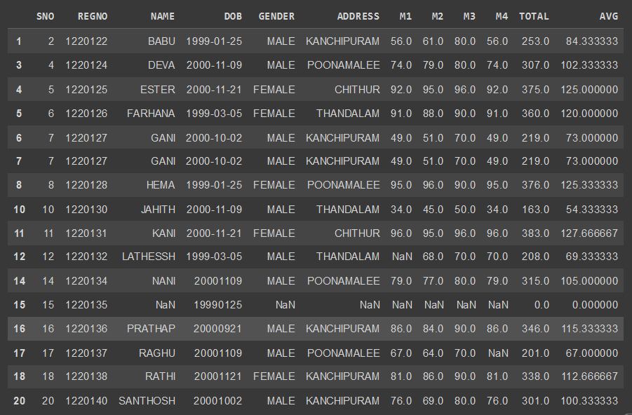

## 10) FIll the Null values
```py
df.fillna(0)
```
## OUTPUT:
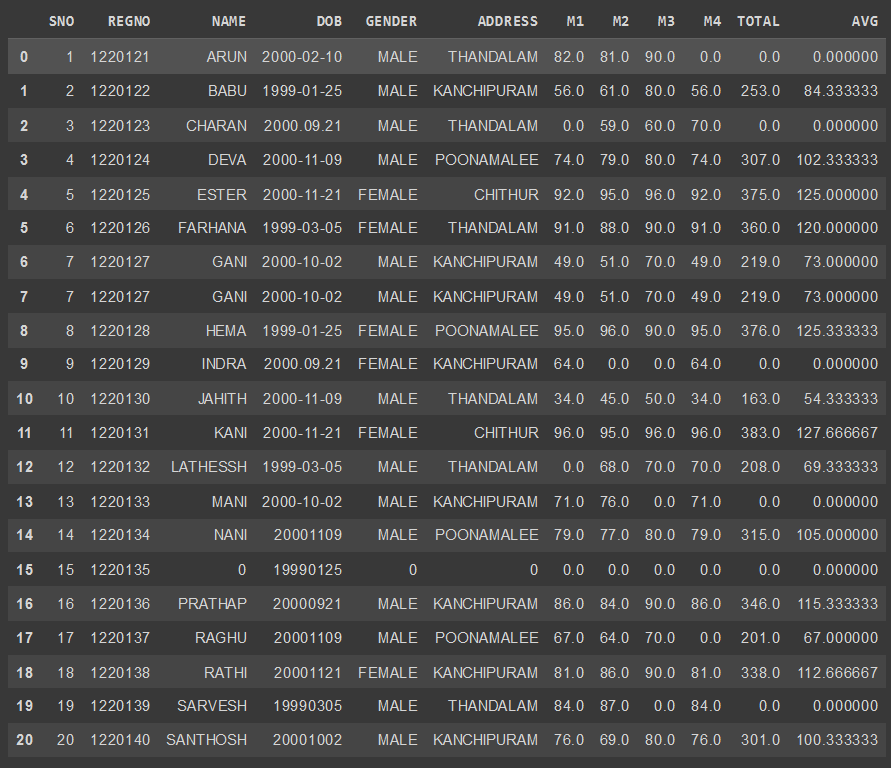

## 11) Finding the mean value
```py
mn=df.TOTAL.mean()
mn
```
## OUTPUT:
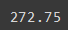

## 12) Final output
```py
for x in df.index:
  if df.loc[x,"AVG"]>100:
    df.drop(x,inplace=True)
df
```
## OUTPUT:
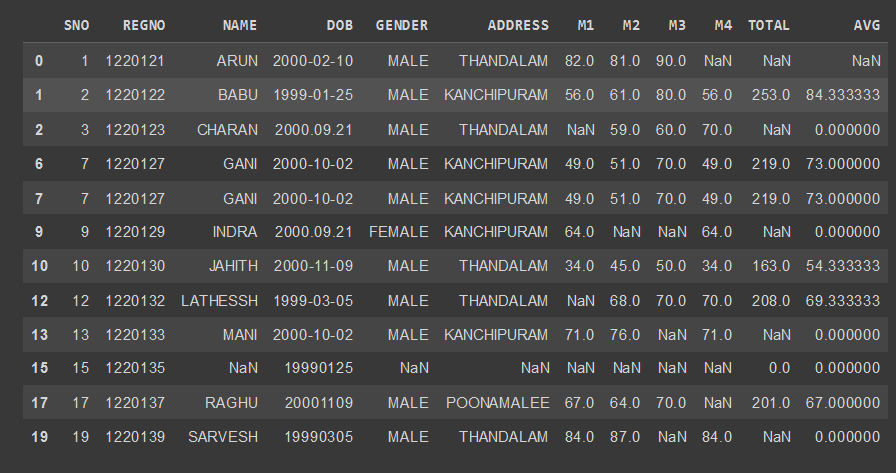

## Result
Hence the data was cleaned , outliers were detected and removed.


